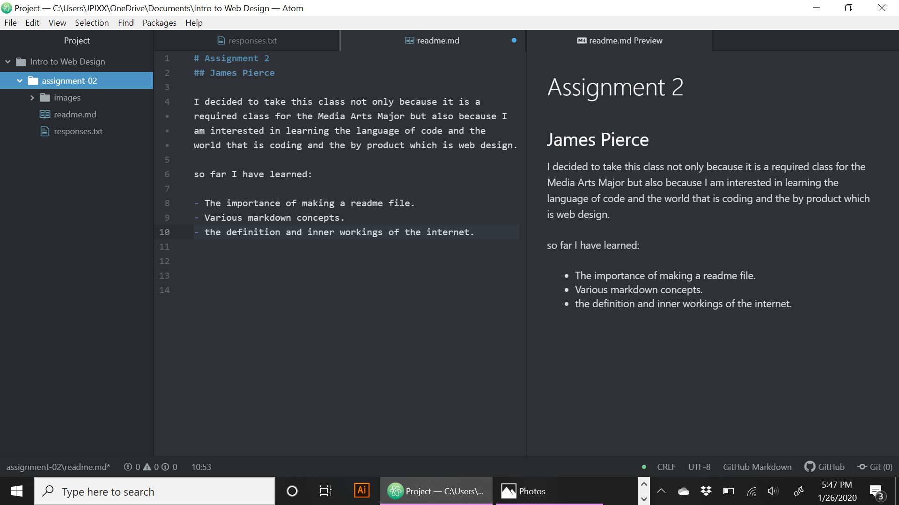

# Assignment 2
## James Pierce

I decided to take this class not only because it is a required class for the Media Arts Major but also because I am interested in learning the language of code and the world that is coding and the by product which is web design.

so far I have learned:

- The importance of making a readme file.
- Various markdown concepts.
- the definition and inner workings of the internet.

[sneaker shopping](http://stockx.com/)

[my responses](./responses.txt)

   
