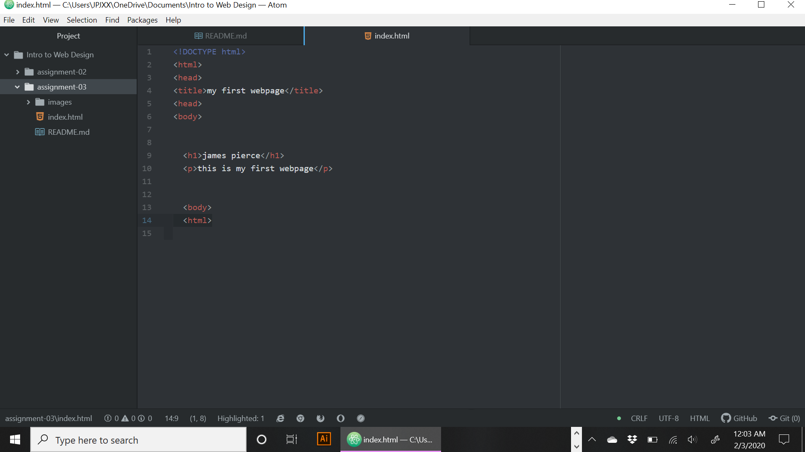

# Assignment 3
## James Pierce

Very briefly detail how browsers function. List any browsers you currently use to surf - or even develop for - the web.

When you go to a website you are sending a request over a network to a server, which responds with contents of that site and the browser interprets the contents and shows the page. I mainly use google chrome.

What is a markup language?

Markup language dictates the architecture of a page (text, design)

 Describe one commonly used in development

HTML- functions as the foundation and structure of a pages content, it is the most widely used web language.

